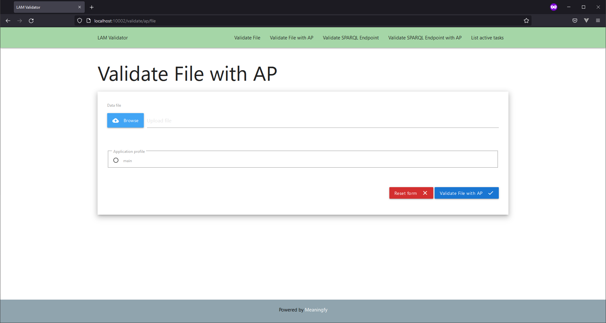

# lam-validator
The LAM validator is used to perform validation of RDF content after it is exported from VocBench 3 platform. The validation procedure is based on SHACL data shape checking and is done using LAM-SKOS-AP application profile. 


# Services and their respective configurations
Please note that the default values can be found in [`/docker/.env.example`](./docker/.env.example). Create a [`/docker/.env`](./docker/.env) file and set the values according to your desired configuration.


### [this file](curl-examples.md) contains a list of examples on how to use the updated api


### RDF Validator API

This service encapsulates the actual validation engine and exposes its functionality as an API.

|Description | Value | Associated variable|
|------------|-------|--------------------|
| Port | 10001 | VALIDATOR_API_PORT|

*NOTE:* When validating SPARQL endpoints, the fully qualified domain name of the machine must be specified. As a consequence, `localhost` will not work.

### RDF Validator UI

|Description | Value | Associated variable|
|------------|-------|--------------------|
| Port | 10002 | VALIDATOR_UI_PORT|

*NOTE:* When validating SPARQL endpoints, the fully qualified domain name of the machine must be specified. As a consequence, `localhost` will never work.

# Requirements

### Software requirements 

A Linux distribution having a kernel with a version higher than 5.4.0.

### Ports

The following ports must be available on the host machine, as they will be bound to by different docker services:

|Port | Service|
|------------|-------|
|10001| RDF Validator API|
|10002| RDF Validator user interface|


# Installation

### Install the Docker engine

 Please follow the official instructions located [here](https://docs.docker.com/engine/install/ubuntu/).
 
### Install Docker compose

Please follow the official instructions located [here](https://docs.docker.com/compose/install/).


### Clone the lam-workflow repository to your target machine
 
 Open a shell and paste the following line, then press `<Enter>`:

```
git clone https://github.com/meaningfy-ws/lam-validator.git
``` 

### Download the docker images and start the containers

In the same shell, navigate to the repository "lam-validator" (where Git cloned the repository).

The default configuration uses the SHACL shapes defined in [`lam-skos-api.ttl`](resources/aps/main/lam-skos-ap.ttl).


> Note! 
> For this update to take place restart the containers.

To add additional default SHACL shape files you could either create a new Application Profile or update the currently provided one (`main`), found in [`resources/aps/`](resources/aps/) folder.

## Run containers
After you have configured the project according to your needs run:
```shell script
make start-services
 ```
in the shell window to start the services.

## Makefile targets

**build-services**
- Uses docker-compose to build all the services defined in the docker/docker-compose.yml file.

**start-services**
- Uses docker-compose to start the services defined in the docker/docker-compose.yml file.

**stop-services**
- Uses docker-compose to stop the services defined in the docker/docker-compose.yml file.

# Contributing
You are more than welcome to help expand and mature this project. 

When contributing to this repository, please first discuss the change you wish to make via issue, email, or any other method with the owners of this repository before making a change.

Please note we adhere to [Apache code of conduct](https://www.apache.org/foundation/policies/conduct), please follow it in all your interactions with the project.  

# Licence 

The documents, such as reports and specifications, available in the /doc folder, are licenced under a [CC BY 4.0 licence](https://creativecommons.org/licenses/by/4.0/deed.en).

The scripts (stylesheets) and other executables are licenced under [GNU GPLv3](https://www.gnu.org/licenses/gpl-3.0.en.html) licence.
